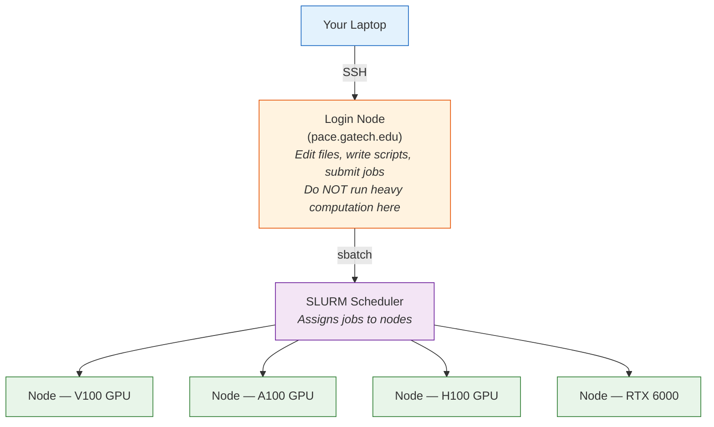
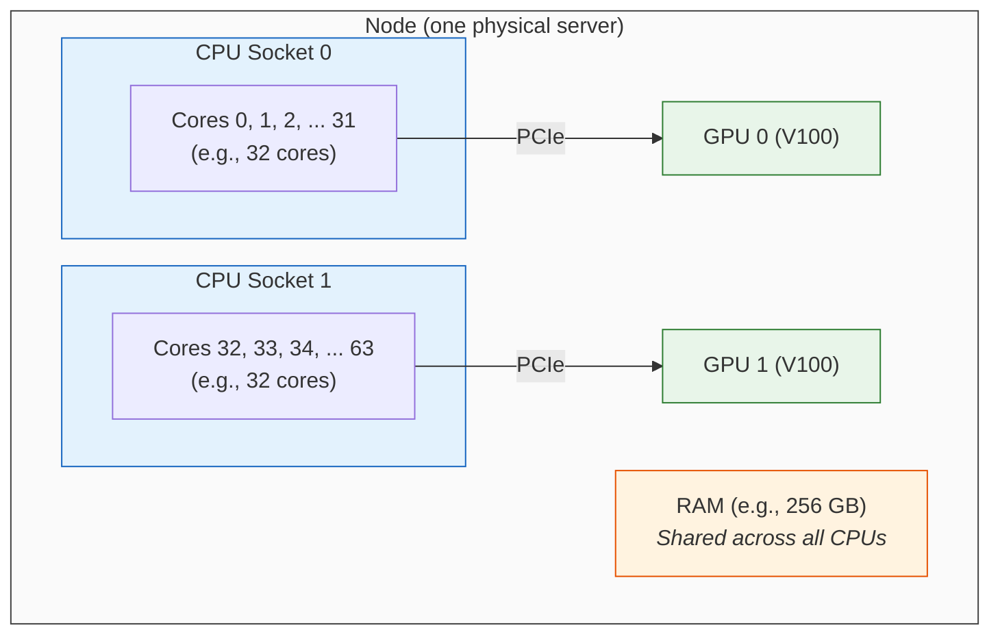
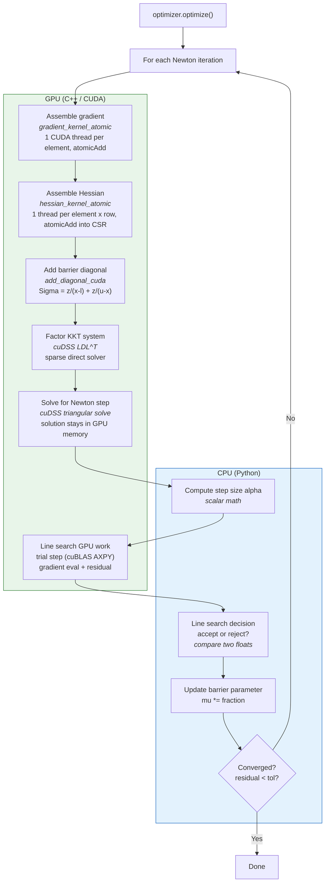
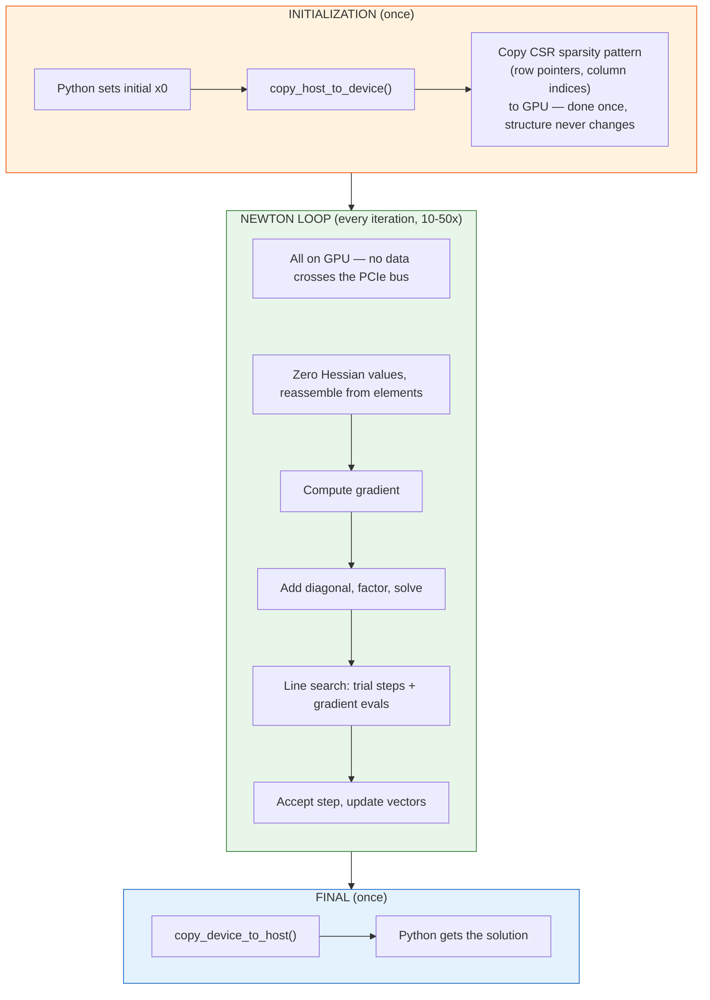
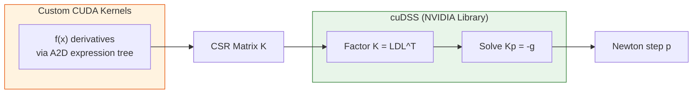
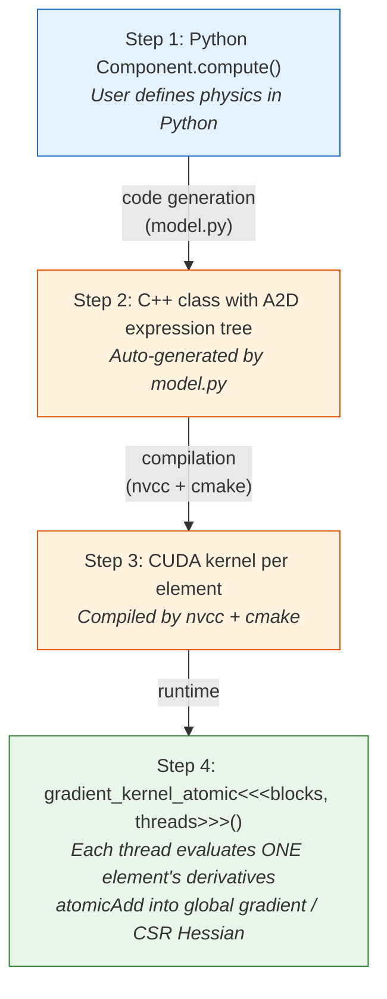
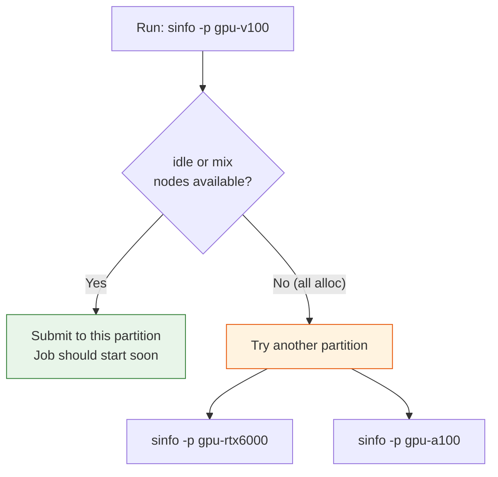

# Running Amigo on PACE with GPU Acceleration

This guide walks through setting up and running Amigo's GPU-accelerated interior point optimizer on Georgia Tech's PACE Phoenix cluster. By the end, you will have a working conda environment with CUDA support and be able to submit GPU jobs via SLURM.

---

## Table of Contents

1. [Key Concepts](#1-key-concepts)
   - [The Cluster](#the-cluster)
   - [Key Terms](#key-terms)
   - [Inside a Node: CPUs, GPUs, and Sockets](#inside-a-node-cpus-gpus-and-sockets)
   - [Why GPU?](#why-gpu)
   - [How Amigo's GPU Architecture Works](#how-amigos-gpu-architecture-works)
   - [What Runs on GPU vs CPU](#what-runs-on-gpu-vs-cpu)
   - [How Data Moves Between CPU and GPU](#how-data-moves-between-cpu-and-gpu)
   - [cuDSS vs Custom CUDA Kernels](#cudss-vs-custom-cuda-kernels)
   - [Code Generation and Automatic Differentiation](#how-code-generation-and-automatic-differentiation-work)
   - [The Compile-Time Execution Policy](#the-compile-time-execution-policy)
2. [Prerequisites](#2-prerequisites)
3. [Connect to PACE](#3-connect-to-pace)
4. [Clone the Repository](#4-clone-the-repository)
5. [Create the Conda Environment](#5-create-the-conda-environment)
6. [Install cuDSS](#6-install-cudss)
7. [Build Amigo with CUDA](#7-build-amigo-with-cuda)
8. [Choose a GPU Partition](#8-choose-a-gpu-partition)
9. [Write the SLURM Job Script](#9-write-the-slurm-job-script)
10. [Submit and Monitor Jobs](#10-submit-and-monitor-jobs)
11. [Troubleshooting](#11-troubleshooting)

---

## 1. Key Concepts

If you are new to HPC clusters, here is a quick overview of the terms used throughout this guide.

### The Cluster

PACE Phoenix is a shared computing cluster — a large collection of interconnected computers (called **nodes**) that researchers submit jobs to. You do not run computations directly on the machine you SSH into. Instead, you write a script describing what you want to run, submit it to a job scheduler, and the scheduler assigns your job to an available node.



### Key Terms

| Term | What It Means |
|------|---------------|
| **Node** | A single physical computer in the cluster. Each node has its own CPUs, RAM, and (on GPU nodes) one or more GPUs. Think of it as one powerful workstation in a server rack. |
| **Login node** | The node you land on when you SSH into PACE. Used for editing files, writing scripts, and submitting jobs. **Never run heavy computation here** — it is shared by all users. |
| **Compute node** | The nodes where actual jobs run. You request these via SLURM. They have the GPUs and fast CPUs. |
| **Partition** | A group of nodes with the same hardware type. For example, `gpu-v100` is a partition containing all nodes with V100 GPUs, and `gpu-a100` contains all nodes with A100 GPUs. When you submit a job, you pick a partition to tell SLURM what kind of hardware you need. |
| **SLURM** | The job scheduler. You give it a script (via `sbatch`), it waits for a matching node to become available, then runs your script on that node. |
| **Job** | A single execution of your script on a compute node. Each job gets a unique ID for tracking. |
| **QOS** | Quality of Service — controls job priority and resource limits. `inferno` is the free tier on PACE (no allocation charge, lower priority). |
| **Allocation / Account** | Your research group's computing budget (e.g., `gts-gkennedy9`). SLURM charges compute hours against this account. `inferno` QOS is free and does not consume allocation hours. |
| **Module** | PACE uses the `module` system to manage software versions. `module load cuda/12.6.1` makes CUDA 12.6.1 available in your session. Without loading it, `nvcc` and CUDA libraries are not on your PATH. |

### Inside a Node: CPUs, GPUs, and Sockets

Each node is a physical computer, but it contains much more than a single processor. Understanding the hardware inside a node helps you request the right resources in your SLURM scripts.

#### What's Inside a Typical GPU Node



The key components:

| Component | What It Is | Typical Count per Node |
|-----------|-----------|----------------------|
| **CPU Socket** | A physical slot on the motherboard that holds one CPU chip. Almost all PACE nodes have exactly **2 sockets** (this is a hardware design choice, not something you control). | 2 |
| **CPU Core** | A single processing unit inside a CPU chip. Each socket holds one chip with many cores (e.g., 32). A 2-socket node with 32-core chips has 64 total cores. | 24–128 |
| **GPU** | A graphics card used for parallel computation. Connected to the motherboard via a **PCIe slot** (a high-speed expansion slot — completely separate from CPU sockets). | 2–8 |
| **RAM** | Main memory, shared across all CPUs. | 128–512 GB |

#### GPUs Connect via PCIe, Not CPU Sockets

A common confusion: **CPU sockets** and **PCIe slots** are different things.

- **CPU socket** = where a CPU chip plugs in. A node typically has 2 sockets, meaning 2 CPU chips. This is a fixed hardware design choice — you cannot change it.
- **PCIe slot** = where a GPU (or network card, or NVMe drive) plugs in. A node can have 2, 4, or 8 PCIe slots for GPUs depending on the chassis.

GPUs are plugged into PCIe slots, **not** into CPU sockets. Each PCIe slot is physically wired to one of the two CPU sockets, which determines which CPU chip has the fastest path to that GPU. This wiring is what the `(S:0-1)` notation in `sinfo` describes (see below), but you can safely ignore it.

#### How Many GPUs Per Node Varies by Partition

Different partitions have nodes with different numbers of GPUs:

```
gpu-v100:     2 GPUs per node     ██░░░░░░
gpu-rtx6000:  4 GPUs per node     ████░░░░
gpu-a100:     8 GPUs per node     ████████
gpu-h100:     8 GPUs per node     ████████
```

When you request `--gres=gpu:v100:1`, you get **1 GPU** out of the 2 available on that node. The other GPU may be used by someone else's job at the same time (that's what `mix` state means in `sinfo`).

#### CPU Cores Are Proportional to GPUs

When you request a GPU, SLURM allocates CPU cores proportionally. The rule of thumb:

```
CPU cores you get  =  (total cores on node) / (total GPUs on node)
```

For example, on a V100 node with 24 cores and 2 GPUs:
- Request 1 GPU → you can use up to 12 CPU cores
- Request 2 GPUs → you can use all 24 cores

**For Amigo, you only need 1 GPU and about 4 CPU cores.** The optimizer does the heavy work on the GPU. The CPU cores handle Python, compiling, and minor data shuffling. Requesting `--cpus-per-task=4` is sufficient.

#### What `(S:0-1)` Means (and Why You Can Ignore It)

In the `sinfo` GRES column, you may see notation like:

```
gpu:v100:2(S:0-1)
              │
              └── S:0-1 means the 2 GPUs are wired to CPU sockets 0 and 1
```

This tells you about **NUMA affinity** — which CPU socket each GPU has the shortest physical path to. In this case, GPU 0 is wired to socket 0, and GPU 1 is wired to socket 1.

This matters for extremely latency-sensitive HPC codes that need to pin CPU threads to the "nearest" socket for each GPU. **For Amigo, this is irrelevant** — SLURM handles the mapping automatically, and our workload is not sensitive to NUMA placement. You can safely ignore the `(S:...)` part of any GRES string.

### Why GPU?

Amigo's interior point optimizer solves a large sparse linear system (the KKT system) at every iteration. On CPU, this is done by MKL PARDISO. With `--with-cuda`, the system is instead assembled and factored on the GPU using CUDA kernels and NVIDIA's cuDSS sparse direct solver. For large problems (thousands of variables), the GPU can be significantly faster because it handles the sparse matrix operations in parallel.

### How Amigo's GPU Architecture Works

Amigo runs a **Python control loop on CPU** that orchestrates **heavy math on GPU**. Think of it as a conductor (CPU) directing an orchestra (GPU). The CPU makes decisions (accept step? reduce barrier? converged?), but all the expensive linear algebra and derivative evaluation happens on the GPU.



### What Runs on GPU vs CPU

| Operation | Where | Why There |
|-----------|-------|-----------|
| **Gradient assembly** | GPU | Thousands of elements evaluated in parallel via CUDA threads |
| **Hessian assembly** | GPU | Same — each element contributes entries to the sparse CSR matrix |
| **Barrier diagonal (Sigma)** | GPU | One kernel launch, one thread per diagonal entry |
| **KKT factorization** | GPU | cuDSS — NVIDIA's optimized sparse direct solver (LDL^T) |
| **KKT solve** | GPU | cuDSS triangular solve, result stays in GPU memory |
| **Vector operations** | GPU | cuBLAS — dot products, axpy, scaling |
| **Line search decisions** | CPU | Just comparing two floats — not worth a kernel launch |
| **Barrier parameter update** | CPU | One scalar multiplication |
| **Convergence check** | CPU | Compare residual against tolerance |
| **Step acceptance/rejection** | CPU | Python logic with scalar comparisons |

### How Data Moves Between CPU and GPU

Data is allocated on the GPU at startup and **stays there** throughout the solve. This avoids the slow PCIe bus transfers that would kill performance if done every iteration.

The `MemoryLocation` enum controls where data lives:

| Memory Mode | Meaning | When Used |
|-------------|---------|-----------|
| `DEVICE_ONLY` | Data exists only in GPU memory | Default for CUDA optimizer — all vectors and matrices |
| `HOST_ONLY` | Data exists only in CPU memory | Non-CUDA builds (OpenMP, serial) |
| `HOST_AND_DEVICE` | Dual copies on both CPU and GPU | When Python needs to inspect GPU data |

The data flow over the life of an optimization:



The key insight: the sparse matrix **pattern** (which entries are nonzero) is copied to GPU once at setup. Only the **numerical values** get zeroed and reassembled each iteration — the sparsity structure never changes during the solve.

### cuDSS vs Custom CUDA Kernels

Amigo uses two different kinds of GPU code:

**Custom CUDA kernels** (written specifically for Amigo):
- Gradient assembly (`gradient_kernel_atomic`)
- Hessian assembly (`hessian_kernel_atomic`)
- Barrier diagonal addition (`add_diagonal_cuda`)
- These are problem-specific — each thread evaluates the A2D expression tree for one element
- NVIDIA does not provide a library for "evaluate my nonlinear expression and assemble derivatives"

**cuDSS** (NVIDIA's library):
- Sparse matrix factorization (LDL^T) and triangular solve
- This is the KKT system solve — pure sparse linear algebra that NVIDIA has highly optimized
- If cuDSS is not installed, Amigo falls back to **cuSOLVER** (QR factorization, slower)



### How Code Generation and Automatic Differentiation Work

When you define a physics component in Python:

```python
class CartPole(Component):
    def compute(self, x, theta, u):
        return 0.5 * u**2   # objective term
```

Amigo's code generator (`model.py`) converts this into C++ using the **A2D** automatic differentiation library:



Each CUDA thread independently walks the expression tree for one element and computes first and second derivatives via reverse-mode automatic differentiation. The `atomicAdd` operations handle the fact that multiple elements share variables (e.g., many time steps write to the same state variable's gradient entry).

### The Compile-Time Execution Policy

The GPU vs CPU choice is a **compile-time constant**, not a runtime flag. When you `pip install` with `-DAMIGO_ENABLE_CUDA=ON`, the generated C++ contains:

```cpp
#ifdef AMIGO_USE_CUDA
  constexpr ExecPolicy policy = ExecPolicy::CUDA;
#elif defined(AMIGO_USE_OPENMP)
  constexpr ExecPolicy policy = ExecPolicy::OPENMP;
#else
  constexpr ExecPolicy policy = ExecPolicy::SERIAL;
#endif
```

Everything is templated on this policy. The compiler resolves all `if constexpr (policy == CUDA)` branches at compile time — zero runtime overhead for the dispatch. The resulting binary is either a GPU optimizer or a CPU optimizer, determined entirely at build time.

This is why you must rebuild (`pip install` again) to switch between CPU and GPU modes, and why `--build` in the example scripts recompiles the example module to match.

---

## 2. Prerequisites

- A Georgia Tech PACE account with an active allocation (e.g., `gts-<your-PI>`)
- GT VPN active (required for SSH access)
- Basic familiarity with Linux, conda, and SLURM

---

## 3. Connect to PACE

```bash
ssh <your_gt_username>@login-phoenix-slurm.pace.gatech.edu
```

> You must be connected to the GT VPN for this to work.

---

## 4. Clone the Repository

```bash
cd ~/scratch
git clone <your-amigo-repo-url> amigo
cd amigo
```

All subsequent commands assume you are inside the `amigo` directory unless stated otherwise.

---

## 5. Create the Conda Environment

### 5.1. Load Required Modules

```bash
module load anaconda3
module load cuda/12.6.1
module load intel-oneapi-mkl/2023.1.0
```

> **Tip:** Run `module spider cuda` to see all available CUDA versions on PACE.
> Press `q` to exit the module spider viewer.

### 5.2. Create and Activate the Environment

```bash
conda create -n amigo-gpu python=3.11 -y
conda activate amigo-gpu
```

### 5.3. Install Python Dependencies

```bash
pip install numpy scipy matplotlib pybind11 mpi4py networkx tabulate icecream
```

---

## 6. Install cuDSS

cuDSS (CUDA Direct Sparse Solver) is the GPU sparse linear solver used by Amigo's `DirectCudaSolver`. It is **not** available as a PACE module, so it must be downloaded manually.

### 6.1. Download and Extract

Pick a location outside the amigo repo to keep things clean (e.g., your project storage directory):

```bash
cd /storage/home/hcoda1/1/$USER/<your-project-dir>

wget https://developer.download.nvidia.com/compute/cudss/redist/libcudss/linux-x86_64/libcudss-linux-x86_64-0.7.1.4_cuda12-archive.tar.xz

tar xf libcudss-linux-x86_64-0.7.1.4_cuda12-archive.tar.xz
```

### 6.2. Set the Environment Variable

```bash
export CUDSS_HOME=$(pwd)/libcudss-linux-x86_64-0.7.1.4_cuda12-archive
```

> **Important:** This variable must also be set in your SLURM job script (see [Section 9](#9-write-the-slurm-job-script)).

---

## 7. Build Amigo with CUDA

From the amigo repo directory:

```bash
cd /path/to/amigo

pip install . \
  --config-settings=cmake.args="-DAMIGO_ENABLE_CUDA=ON;-DAMIGO_ENABLE_CUDSS=ON;-DCMAKE_CUDA_ARCHITECTURES=<arch>;-DCUDSS_HOME=$CUDSS_HOME"
```

Replace `<arch>` with the correct value for your target GPU (see table below).

### What This Does

| Flag | Purpose |
|------|---------|
| `AMIGO_ENABLE_CUDA=ON` | Compiles CUDA kernels for GPU-accelerated hessian/gradient assembly |
| `AMIGO_ENABLE_CUDSS=ON` | Enables cuDSS sparse direct solver for GPU factorization |
| `CMAKE_CUDA_ARCHITECTURES=<arch>` | Targets the specific GPU compute capability |
| `DCUDSS_HOME=...` | Tells CMake where to find the cuDSS library |

### GPU Architecture Reference

| GPU | Architecture | Compute Capability | PACE Partition |
|-----|-------------|-------------------|----------------|
| V100 | Volta | `70` | `gpu-v100` |
| RTX 6000 | Turing | `75` | `gpu-rtx6000` |
| A100 | Ampere | `80` | `gpu-a100` |
| L40S | Ada Lovelace | `89` | `gpu-l40s` |
| H100 | Hopper | `90` | `gpu-h100` |
| H200 | Hopper | `90` | `gpu-h200` |

> **Note:** Code compiled for an older architecture (e.g., `70`) will run on newer GPUs via
> forward compatibility, but may not be optimal. For best performance, match the architecture
> to the GPU you will actually use.

---

## 8. Choose a GPU Partition

Before submitting a job, you need to know which GPU partitions exist and whether any nodes
are free. SLURM provides the `sinfo` command for this, but its output can be confusing.
This section walks through how to read it.

### 8.1. List Available GPU Partitions

```bash
sinfo -o "%P %a %G" | grep gpu
```

This prints three columns: **Partition**, **Availability**, and **GRES** (Generic Resources).

```
PARTITION       AVAIL  GRES
gpu-v100        up     gpu:v100:2(S:0-1)
gpu-a100        up     gpu:a100:8(S:0-1)
gpu-h100        up     gpu:h100:8(S:0-1)
gpu-h200        up     gpu:h200:8(S:0-1)
gpu-l40s        up     gpu:l40s:8(S:0-1)
gpu-rtx6000     up     gpu:rtx_6000:4(S:0-1)
```

How to read each column:

| Column | Example | Meaning |
|--------|---------|---------|
| `PARTITION` | `gpu-v100` | Name of the partition. You use this in `#SBATCH -p gpu-v100`. |
| `AVAIL` | `up` | Whether the partition is accepting jobs. `up` = yes, `down` = no. |
| `GRES` | `gpu:v100:2(S:0-1)` | GPU resources per node (see breakdown below). |

**Reading the GRES column** — `gpu:v100:2(S:0-1)` means:

```
gpu:v100:2(S:0-1)
│   │     │  │
│   │     │  └── (S:0-1) = GPUs are on CPU sockets 0 and 1 (ignore this)
│   │     └── 2 = each node in this partition has 2 GPUs
│   └── v100 = GPU model name (this is what goes in --gres)
└── gpu = resource type
```

So `gpu:rtx_6000:4(S:0-1)` means each RTX 6000 node has 4 GPUs. You typically request just 1
with `--gres=gpu:rtx_6000:1`.

> **Why do some partitions appear twice?** The A100 partition might show two lines:
> ```
> gpu-a100  up  gpu:a100:2(S:2,5)
> gpu-a100  up  gpu:a100:8(S:0-1)
> ```
> This means the `gpu-a100` partition has two types of nodes: some with 2 GPUs and some
> with 8 GPUs. SLURM will assign whichever is available. You don't need to pick — just
> request `gpu:a100:1` and SLURM handles the rest.

### 8.2. Check Node Availability

To see which nodes are free right now:

```bash
sinfo -p gpu-v100
```

Example output:

```
PARTITION   AVAIL  TIMELIMIT  NODES  STATE    NODELIST
gpu-v100    up     infinite   3      mix      atl1-1-01-001-[5-7]-0
gpu-v100    up     infinite   2      idle     atl1-1-01-001-[8-9]-0
gpu-v100    up     infinite   5      alloc    atl1-1-01-001-[1-4]-0,atl1-1-01-002-1-0
```

How to read this:

| Column | Example | Meaning |
|--------|---------|---------|
| `PARTITION` | `gpu-v100` | The partition name. |
| `TIMELIMIT` | `infinite` | Max walltime allowed (often overridden by QOS). |
| `NODES` | `3` | Number of nodes in this state. |
| `STATE` | `mix` | Current state of these nodes (see table below). |
| `NODELIST` | `atl1-1-01-001-[5-7]-0` | Actual hostnames (you can ignore these). |

**Node states — what each one means:**

| State | What It Means | Can I Use It? |
|-------|---------------|---------------|
| `idle` | Completely free. No jobs running. | **Yes** — your job will start immediately. |
| `mix` | Partially used. Some CPUs or GPUs are still free. | **Yes** — your job may start if enough resources are free. |
| `alloc` | Fully allocated. All CPUs and GPUs in use. | **No** — you must wait for jobs to finish. |
| `drain` | Taken offline by admins (maintenance, hardware issue). | **No** — unavailable. |
| `down` | Broken or powered off. | **No** — unavailable. |

**Quick decision flow:**



> **Tip:** `gpu-rtx6000` often has shorter queue times because fewer people request it.

### 8.3. Check All GPU Partitions at Once

To quickly scan everything:

```bash
sinfo -o "%P %a %l %D %t %G" | grep gpu
```

This adds **NODES** (`%D`) and **STATE** (`%t`) columns so you can see availability for
every partition in one command.

You can also check how many jobs are queued ahead of you:

```bash
squeue -p gpu-v100 | wc -l     # Count jobs in queue for V100
squeue -p gpu-rtx6000 | wc -l  # Count jobs in queue for RTX 6000
```

### 8.4. Partition-Specific SLURM Settings

Each partition has different resource limits. Match your `#SBATCH` lines to the partition
you pick:

| Partition | `--gres` value | `-p` value | Max CPUs per GPU |
|-----------|---------------|------------|-----------------|
| `gpu-v100` | `gpu:v100:1` | `gpu-v100` | 12 |
| `gpu-rtx6000` | `gpu:rtx_6000:1` | `gpu-rtx6000` | 6 |
| `gpu-a100` | `gpu:a100:1` | `gpu-a100` | 12 |
| `gpu-h100` | `gpu:h100:1` | `gpu-h100` | 12 |

> **Important:** The `--gres` value must match the GPU name shown in `sinfo` output **exactly**
> (including underscores). For example, RTX 6000 is `rtx_6000` (with underscore), not `rtx6000`.

---

## 9. Write the SLURM Job Script

Create `run_cartpole.sbatch` in your working directory:

```bash
#!/bin/bash
#SBATCH --job-name=cartpole
#SBATCH --account=gts-<your-PI>          # Your PI's allocation
#SBATCH --nodes=1
#SBATCH --ntasks=1
#SBATCH --cpus-per-task=4
#SBATCH --gres=gpu:v100:1                # GPU type and count
#SBATCH -p gpu-v100                      # Matching partition
#SBATCH --time=1:00:00
#SBATCH --qos=inferno
#SBATCH --output=cartpole_%j.out

# ── Environment Setup ─────────────────────────────────────────────
source ~/.bashrc
module purge
module load anaconda3
module load cuda/12.6.1
module load intel-oneapi-mkl/2023.1.0
source activate amigo-gpu

# ── cuDSS Library Path ───────────────────────────────────────────
export CUDSS_HOME=/path/to/libcudss-linux-x86_64-0.7.1.4_cuda12-archive
export LD_LIBRARY_PATH=$CUDSS_HOME/lib:$LD_LIBRARY_PATH

# ── Rebuild Amigo (optional — skip if already installed) ─────────
AMIGO_DIR=/path/to/amigo

pip install "$AMIGO_DIR" \
  --config-settings=cmake.args="-DAMIGO_ENABLE_CUDA=ON;-DAMIGO_ENABLE_CUDSS=ON;-DCMAKE_CUDA_ARCHITECTURES=70;-DCUDSS_HOME=$CUDSS_HOME" 2>&1

# ── Run ──────────────────────────────────────────────────────────
cd "$AMIGO_DIR/examples/cart"
python cart_pole.py --build --with-cuda --num-time-steps 100
```

### Script Flags Explained

| Flag | Purpose |
|------|---------|
| `--build` | Compiles the example's C++ module (needed on first run or after code changes) |
| `--with-cuda` | Uses `DirectCudaSolver` (GPU) instead of the default CPU solver |
| `--num-time-steps N` | Number of collocation time steps in the trajectory optimization |

> **After the first successful run**, you can drop `--build` to skip recompilation. Only
> re-add it if you modify the example's expressions or component code.

---

## 10. Submit and Monitor Jobs

### Submit

```bash
sbatch run_cartpole.sbatch
```

### Monitor

```bash
squeue -u $USER              # Check job status (PD=pending, R=running)
tail -f cartpole_*.out       # Watch output live while running
cat cartpole_*.out           # View full output after completion
```

### Cancel

```bash
scancel <job_id>             # Cancel a specific job
scancel -u $USER             # Cancel all your jobs
```

### Check Storage/Allocation

```bash
pace-quota
```

---

## 11. Troubleshooting

### "BLAS not found" during build

CMake cannot locate a BLAS library. Load MKL before building:

```bash
module load intel-oneapi-mkl/2023.1.0
```

Run `module spider mkl` to see available versions.

### "cuDSS not found" during build

Make sure `CUDSS_HOME` is set and points to the extracted cuDSS directory:

```bash
echo $CUDSS_HOME         # Should print the path
ls $CUDSS_HOME/lib       # Should list .so files
```

### ImportError: unknown base type `ComponentGroupBase<double, (ExecPolicy)1>`

This means the main amigo module and the example module were compiled with different execution policies (e.g., OpenMP vs CUDA). Fix:

```bash
# Delete the example's build cache and rerun
rm -rf examples/cart/_amigo_build
python cart_pole.py --build --with-cuda
```

### Optimizer not converging (residual stuck)

If the residual stays constant across all iterations, the GPU solver may be reading
empty data. Make sure you are using a version of amigo where `AMIGO_USE_CUDA` takes
priority over `AMIGO_USE_OPENMP` in the `#ifdef` chain (fixed in commit XXXXX).

### Job stuck in pending (`PD`) state

Try a different GPU partition with more availability:

```bash
sinfo -p gpu-rtx6000      # Check if nodes are idle
```

Then update `--gres`, `-p`, and `CMAKE_CUDA_ARCHITECTURES` in your sbatch script accordingly.

---

## Quick Reference

```
# One-time setup (on login node)
module load anaconda3 cuda/12.6.1 intel-oneapi-mkl/2023.1.0
conda activate amigo-gpu
export CUDSS_HOME=/path/to/cudss
pip install /path/to/amigo --config-settings=cmake.args="..."

# Submit a job
sbatch run_cartpole.sbatch

# Check status
squeue -u $USER

# View output
cat cartpole_*.out
```
